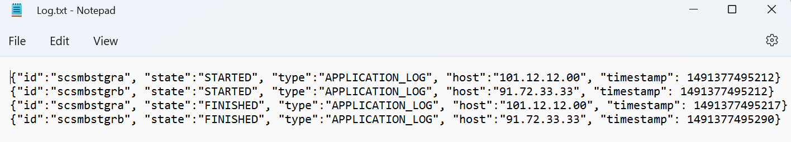
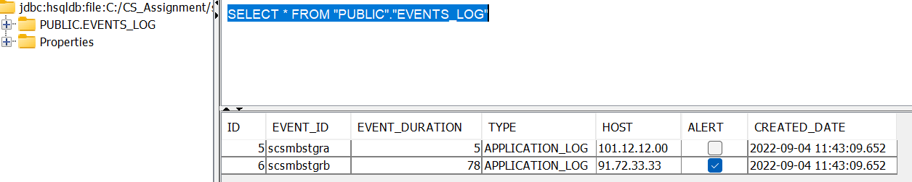

Steps To Run this application
-----------------------------
- Install and configure Maven (if not installed)
- Open command prompt
- navigate to project folder
- run "mvn clean install" command
- java -jar target/Assignment-1.0-SNAPSHOT.jar <<!Complete Path To Your file!>>
  - e.g. java -jar target/Assignment-1.0-SNAPSHOT.jar C:\STS\Log.txt
- Location of file based HSQLDB will be the "resources" folder of the application
- IDE like Intellij has facility (View --> Tool Windows --> Datasource ) to connect to the file based HSQLDB and view the records inserted.
- Or, Install hsqldb locally to use HyperSQL database manager.
- Below given screenshot shows records being persisted into database
    - Input:
    - 
    - OutPut:
    - 